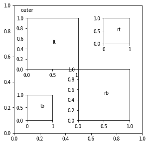

# matpos

Providing easy method for layouting subplots in using matplotlib.

When you want to make complex layout, you can define absolute size of each subplot.
And you can also set its position according to relative margin from the other subplot with this package.

## Usage

1. Install

By pip,

```
pip install git+https://github.com/Fumipo-Theta/matpos.git
```

2. Import

```python
from matpos import MatPos
```

3. Generate a manager for layoutong subplots.

Pass dict of padding around subplots. The unit is inches.

```python
padding = {
    "left" : 1,
    "right" : 1,
    "top" : 1,
    "bottom" : 1
}

mp = MatPos(padding)
```

4. Set size and relative position of each subplot.

Instance of MatPos provides some method to define size and relative position of subplots.

* from_left_top(subgrid, size, offset)
* from_left_bottom(subgrid, size, offset)
* from_right_top(subgrid, size, offset)
* from_right_bottom(subgrid, size, offset)

These methods return new subgrid, having attributes of their size of plot area and offset of position from origin.
For the first subgrid, these method recieve instance of MatPos.
MatPos objects generate matplotlib.pyplot.figure and matplotlib.pyplot.axsubplot objects from the subgrids by `figure_and_axes` method.

```python
mp = MatPos(padding)

outer = mp.from_left_top(mp, (5,5))
lt = mp.from_left_top(outer, (2,2), (0.5,0.5))
lb = mp.from_left_bottom(outer, (1,1), (0.5,0.5))
rt = mp.from_right_top(outer, (1,1), (0.5,0.5))
rb = mp.from_right_bottom(outer, (2,2), (0.5,0.5))

fig, axs = mp.figure_and_axes([outer, lt, lb, rt, rb])

axs[0].text(0.05,0.95, "outer")
axs[1].text(0.5,0.5,"lt")
axs[2].text(0.5,0.5,"lb")
axs[3].text(0.5,0.5,"rt")
axs[4].text(0.5,0.5,"rb")
```
The above code generates 5 subplots: [0] is outer subplot having 5 inches x 5 inches plot area; [1] ~ [4] are inner subplots they have 2 x 2 or 1 x 1 size of plot area.
Inner subplots are layouted from 4 apexes of plot area of outer subplot.
Parameter of "offset" is margin between apexes of plot areas of former and latter subplots.




The next group can be used as layouting the new subplot adjacent to a former subgrid.
* add_top(subgrid, size, margin, offset)
* add_left(subgrid, size, margin, offset)
* add_right(subgrid, size, margin, offset)
* add_bottom(subgrid, size, margin, offset)

```python
mp = MatPos(padding)

a = mp.add_bottom(mp,(3,3))
b = mp.add_top(a, (3,3), margin=0.5)
c = mp.add_right(a, (3,3), margin=0.5)
d = mp.add_bottom(a, (3,3), margin=0.5)
e = mp.add_left(a, (3,3), margin=0.5)

fig, axes = mp.figure_and_axes([a,b,c,d,e])

axes[0].text(0.5,0.5,"a")
axes[1].text(0.5,0.5,"b")
axes[2].text(0.5,0.5,"c")
axes[3].text(0.5,0.5,"d")
axes[4].text(0.5,0.5,"e")
```

The above code generates five subplots.


If size contains None, width or height is expanded to fit the figure size at the time.
And offset is indicated, position of the next subplot is shiftted.

```python
mp = MatPos(padding)

a = mp.from_left_top(gf,(4,3))
b = mp.add_right(a, (1,None), margin=0.5, offset=(0,1))
c = mp.add_bottom(a, (None,1), margin=0.5, offset=(1,0))

fig, axes = gf.figure_and_axes([a,b,c])

axes[0].text(0.5,0.5,"a")
axes[1].text(0.5,0.5,"b")
axes[2].text(0.5,0.5,"c")
```


MatPos also provides easy way to generate grid layout by `add_grid` method.
It requires list of sizes of subplots, number of culumns for grid, and tuple of horizontal and vertical margin between subplots.

```python
subgrids = mp.add_grid([(2,2) for i in range(9)], column=3, margin=(1,0.5))

fig, axs = mp.figure_and_axes(subgrids)
```

The above code generates nine subplots on 3 x 3 grid.

